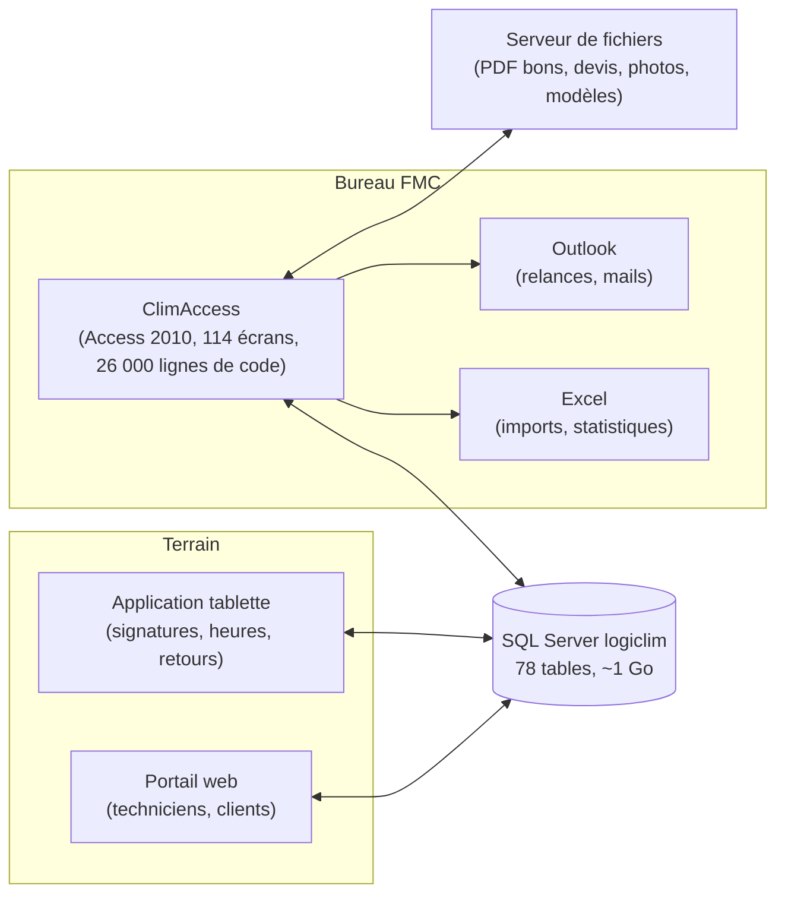
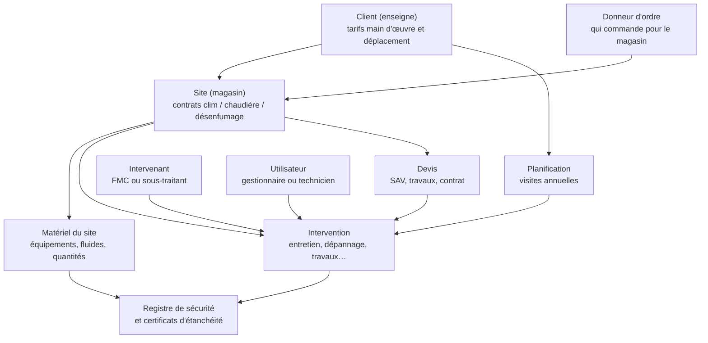
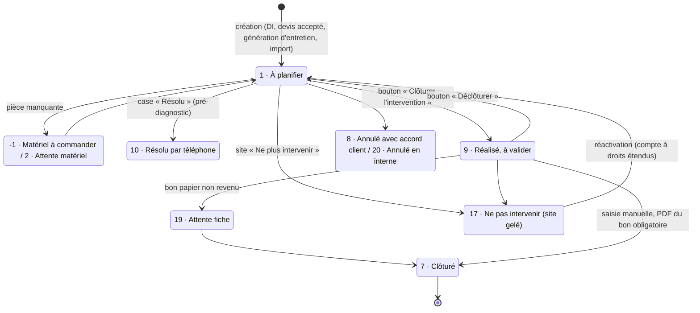
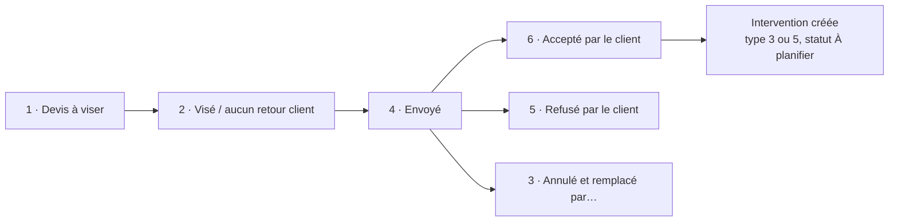
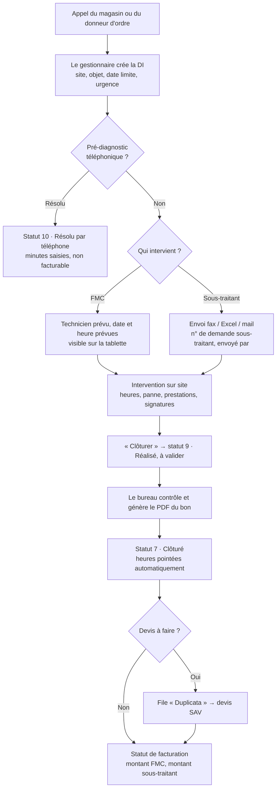
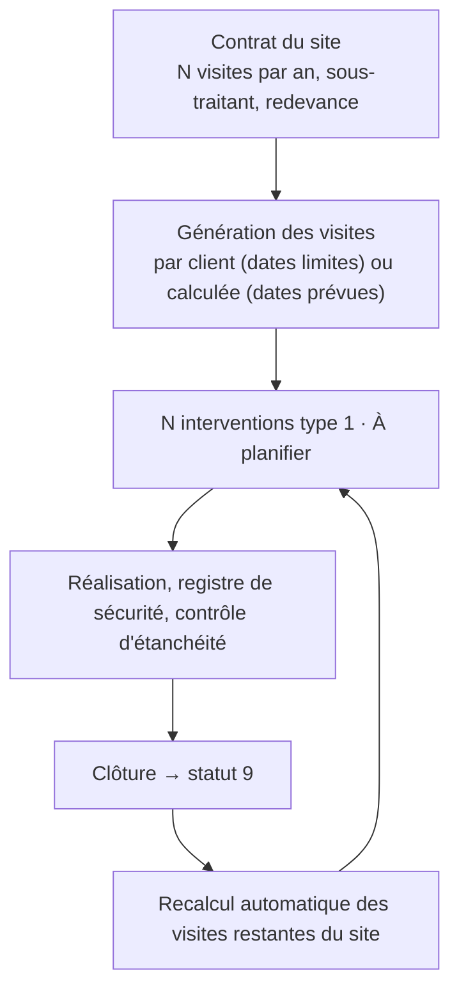
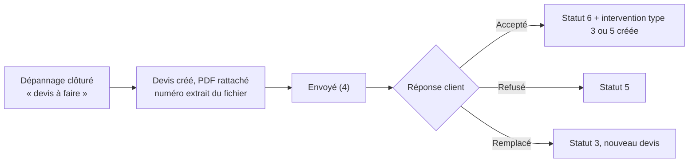
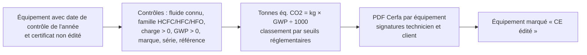

# ClimAccess : l'application existante

> **ClimAccess** est l'application interne de FMC pour gérer la maintenance CVC (climatisation,
> désenfumage, chaudières) des magasins de ses clients enseignes. Elle pilote tout le cycle : demande
> d'intervention, planification des entretiens, techniciens et sous-traitants, bons d'intervention,
> devis, facturation, contrôle réglementaire des fluides.
>
> Ce document décrit **ce que fait l'application** et **comment elle fonctionne**, à partir du code
> VBA (26 410 lignes lues intégralement), des écrans, du schéma SQL Server et des tables de référence.
> Les détails techniques sont dans des blocs repliés. Les analyses complètes par domaine sont dans
> `legacy/analysis/`.

## Sommaire

1. [L'essentiel](#1-lessentiel)
2. [Le modèle métier](#2-le-modèle-métier)
3. [Utilisateurs et connexion](#3-utilisateurs-et-connexion)
4. [L'écran d'accueil](#4-lécran-daccueil--un-tableau-de-bord)
5. [Les objets métier](#5-les-objets-métier)
6. [Les processus clés](#6-les-processus-clés)
7. [Documents et intégrations](#7-documents-produits-et-intégrations)
8. [Points d'attention pour la migration](#8-points-dattention-pour-la-migration)
9. [Questions à confirmer avec FMC](#9-questions-à-confirmer-avec-fmc)
10. [Annexes : glossaire et codes](#10-annexes)

## 1. L'essentiel

| Indicateur | Valeur |
|---|---|
| Sites (magasins) suivis | 6 163, pour 2 323 clients |
| Interventions depuis 2007 | 71 694 |
| Devis (SAV, travaux, contrats) | 19 822 |
| Équipements inventoriés | 29 511 |
| Utilisateurs | 317 (34 gestionnaires, 277 techniciens, 4 mixtes) |

Ce que fait l'application, par métier :

- **Accueil SAV** : enregistre une demande d'intervention (DI) d'un client pour un magasin, avec date limite et urgence.
- **Planification** : génère automatiquement les visites d'entretien annuelles de chaque magasin selon son contrat, et place les dépannages.
- **Terrain** : affecte un technicien FMC ou un sous-traitant, produit le bon d'intervention, récupère heures, signatures et commentaires.
- **Bureau** : valide les interventions réalisées, clôture, décide de la facturation, suit les devis à produire.
- **Devis** : suit les devis SAV, travaux et contrats de maintenance, du chiffrage à l'acceptation, qui déclenche une nouvelle intervention.
- **Réglementaire** : tient le registre de sécurité et produit les certificats de contrôle d'étanchéité des fluides frigorigènes (Cerfa).
- **Pilotage** : compteurs temps réel sur l'écran d'accueil, statistiques par client exportées vers Excel, cartes des interventions.
- **Annexe** : suivi du parc de véhicules des techniciens (kilométrage, contrôles techniques, révisions).

**Architecture actuelle.** Access n'est que l'écran : toutes les données vivent dans une base SQL
Server nommée `logiclim`, partagée avec un portail web et une application tablette pour les
techniciens. Les documents (PDF, devis, photos) sont sur un serveur de fichiers Windows.

**Ce que fait la base SQL Server elle-même** : un déclencheur donne à toute nouvelle intervention un
numéro de bon égal à son numéro interne ; un autre historise chaque sortie du statut « à planifier » ;
les dates de dernière modification des sites et interventions sont posées automatiquement ; une
procédure recalcule la date de dernière visite d'entretien de chaque site. Une vingtaine de
procédures « pager » servent le portail web (interventions à faire ou faites du jour, des 7 et 14
derniers jours, par intervenant, par zone, sites par client) et une vue dédiée alimente la tablette.
Une vue « FileMaker » exporte sites et interventions vers un ancien outil FileMaker. Voir
`legacy/sql_modules.sql`.

## 2. Le modèle métier

| Objet | C'est quoi, concrètement | Table source | Volume |
|---|---|---|---|
| Client | Une enseigne (Celio, Calzedonia, GIFI, OGF…). Porte les tarifs horaires et de déplacement facturés. | `Client` | 2 323 |
| Donneur d'ordre | L'organisation qui commande les interventions pour un magasin (siège, gestionnaire d'immeubles). Distinct du client facturé. | `Donneur` | 103 |
| Site | Un magasin : adresse, horaires, géolocalisation, jusqu'à trois contrats (clim, chaudière, désenfumage), sous-traitants, indicateurs. | `Site` | 6 163 |
| Matériel | Chaque équipement installé sur un site : marque, référence, numéro de série, fluide et charge en kg. | `SiteMateriel` | 29 511 |
| Intervention | Une demande d'intervention et sa réalisation : type, statut, dates, technicien, bon PDF, montants, facturation. | `Intervention` | 71 694 |
| Devis | Un devis SAV, travaux ou contrat de maintenance, avec son PDF, son statut et ses montants. | `Devis`, `DevisTravaux`, `ContratDeMaintenance` | 19 822 |
| Intervenant | Une entreprise qui intervient : FMC elle-même ou un sous-traitant, avec zones, activités et tarifs. | `Intervenant` | 193 |
| Utilisateur | Une personne : gestionnaire de bureau ou technicien terrain, rattachée à une société (FMC ou sous-traitant). | `Utilisateur` | 317 |

## 3. Utilisateurs et connexion

Trois profils (`Utilisateur.typuti`) :

| Profil | Code | Comptes | Rôle |
|---|---|---|---|
| Gestionnaire | 1 | 34 | Bureau FMC. Le seul profil qui ouvre Access : saisit, planifie, valide, facture. |
| Technicien | 2 | 277 | N'ouvre pas Access. Techniciens FMC **et** des sous-traitants (chaque utilisateur a une « société » : FMC Clim, FMC Maintenance, FMC Bureau, ou l'une des 120 entreprises sous-traitantes). Travaille sur la tablette ou le portail. |
| Gestionnaire (Tech) | 3 | 4 | Hybride, sans règle particulière dans le code. |

> **Il n'y a pas de mot de passe pour entrer.** Au démarrage, l'utilisateur choisit son nom dans une
> liste. Les boutons s'affichent ensuite. Quelques actions sensibles sont protégées par des mots de
> passe codés en dur dans le programme ou dérivés de la date du jour.

Détails : droits et comptes spéciaux

- La liste de connexion ne montre que les gestionnaires ayant un code intervenant renseigné et hors société n°1 (« Ancien salarié FMC »).
- Un compte nominatif à droits étendus (surnommé « Kadi » dans le code, utilisateur n°367) est seul autorisé, après un mot de passe à 4 chiffres, à modifier les statuts de facturation marqués « réservés » (`StatutFacture.QueKadi`) et à réactiver les interventions d'un site gelé.
- Deux comptes nominatifs (n°65 et 66) voient un bouton « Voir Tables » d'administration.
- La modification des référentiels statuts et types demande un mot de passe calculé à partir de la date du jour.
- L'application réécrit à chaque ouverture la connexion ODBC vers SQL Server (DSN `CLIMACCESS`) avec un identifiant et un mot de passe en clair dans le code.
- Les mots de passe du portail web des techniciens sont générés par Access (stockés dans `Utilisateur.codintuti`, en clair) et envoyés par mail en clair.

## 4. L'écran d'accueil : un tableau de bord

L'écran d'entrée (formulaire `MenuClimAccess`) est une grille de grandes icônes cliquables et de
compteurs rafraîchis toutes les 60 secondes. C'est la « to-do list » du bureau.

| Bouton | Ce qu'il ouvre |
|---|---|
| CLIENTS | Liste des clients actifs, fiche client, sites et contacts |
| SITES | Recherche multicritère des magasins |
| INTERVENANTS | Annuaire des sous-traitants et techniciens |
| ENTRETIEN / DÉPANNAGE / DEVIS ACCEPTÉS | La liste générale des interventions, ouverte sur « à valider » |
| DEVIS SAV, DEVIS Travaux, Contrat de Maintenance | Les trois listes de devis |
| STATISTIQUES | Exports Excel de bilan par client |
| Carte | Carte des interventions à réaliser |
| Véhicules, Utilisation FF, Filtre Extraction, Intervalle tablette | Parc auto, consommation de fluides, export du parc matériel, période visible sur les tablettes |
| PARAMÉTRAGE | Tous les référentiels |

Compteurs affichés en permanence (source : vue `ListeInterventionGenerale2`) :

| Compteur | Signification | Règle |
|---|---|---|
| Fiches d'interventions à valider | Réalisées par le terrain, à contrôler par le bureau | `staint = 9` |
| Fiches à facturer | Validées, prêtes pour la facturation | `nbrappint = 1` |
| À valider par le Boss | Facturations en attente d'arbitrage de la direction | `nbrappint = 8` |
| Stand By | Facturations en attente | `nbrappint = 9` |
| Dépannage, Maintenances, Devis SAV acceptés, En travaux, Autres | Ventilation par type des interventions en statut facturation 1 ou 2 | `typint` 2, 1, 3, 5, autres |
| Matériel à commander, Attente matériel | Bloquées par une pièce | `staint` -1 et 2 |
| Duplicata (Total, À traiter, Attente offre de prix) | Clôturées où un devis reste à produire | `staint = 7 and devisafaire`, ventilé par `duplicatafait` |
| Problèmes véhicules | Alertes CT, contrôle complémentaire, leasing, garantie, révision | voir 5.9 |

Détails : ce qui tourne en arrière-plan à chaque ouverture

- **Relances SAV automatiques** : pour chaque intervention `staint = 1` avec une case rappel cochée (24 h, 48 h, 72 h, semaine), un mail Outlook part vers la boîte SAV interne dès que le délai depuis `dateenvoimail` est dépassé, puis `dateenvoimail = now`. Pas de tâche planifiée : dépend de l'ouverture d'Access.
- **Pont avec le portail web** : toutes les 2 s, Access lit `Demande_Web` ; si le portail y a déposé une demande pour l'utilisateur connecté, Access ouvre la fiche du site.
- **Fichier de vie** : toutes les 6 s, Access écrit « Je suis vivant » dans `C:\Users\Public\<AAAA>\<M>\FichierVieAccess.txt`, surveillé par un programme externe.
- Un **ancien menu** (`MenuPrincipal`, héritage Clim'Tech) reste accessible : plus de 130 états statistiques anciens, vocabulaire de statuts différent (il appelle `staint = 9` « clôturée »).

## 5. Les objets métier

### 5.1 Client et donneur d'ordre

Le **client** est l'enseigne facturée. Sa fiche porte l'adresse, le contact principal et deux tarifs
utilisés par les devis et les statistiques : le tarif horaire de main d'œuvre (`coutheuremainoeuvre`)
et le tarif d'un déplacement (`coutdeplacement`). Un client peut être masqué des listes sans être
supprimé (`affcli`). Deux numéros « Esabora » (le logiciel de facturation de FMC, très utilisé) sont
stockés dans les colonnes détournées `cheminpho` et `cheminpla`.

Le **donneur d'ordre** est l'organisation qui commande les interventions pour un magasin. Il a ses
propres contacts, un délai d'intervention contractuel en heures, un logo et des lignes de pied de
page pour les documents imprimés à son nom. Un site est rattaché à un client **et** éventuellement à
un donneur d'ordre (`Site.donneurid`).

Détails techniques

- Recherche sur la fiche client : un nombre saisi est interprété comme un numéro de magasin (`Site.numsit`), un texte comme un nom de client.
- Onglet « Devis » de la fiche client : jamais développé.
- « Voir sur Maps » lance Internet Explorer avec une URL Google Maps : cassé.
- Sur le donneur, `meldonneur`, `cheminpho`, `cheminpla` servent de lignes 1 à 3 de pied de page (et `cheminpho` aussi de logo).

### 5.2 Site (magasin)

Le site est l'objet central. Sa fiche à onglets regroupe :

- **Identité** : client, donneur d'ordre, numéro de magasin donné par l'enseigne (`numsit`, non unique), code (`codsit`), nom, adresse, téléphone, responsable, zone géographique (`numzonsit`), coordonnées GPS et précision du géocodage, raccourci vers le dossier réseau (`chemindoc`).
- **Installation** : date de mise en service, situation (`sitsit` : clim dépendante ou indépendante, centre commercial ou centre-ville, Eficia), type H/F (`typsit`), fluide, températures, indicateurs de qualité, vétusté (1 à 5 étoiles), puissance, accessibilité, GTB, garanties en années (pièces, main d'œuvre, compresseur).
- **Trois contrats d'entretien**, un par lot : climatisation (deux redevances FMC : technique `mntredev` et filtres `montantredevancefiltre`), chaudière, désenfumage. Chacun avec numéro de contrat, date, **nombre de visites par an** (`nbrentsit` pour la clim, donnée pivot de la planification), redevance, sous-traitant (`NumSousTraitClim/Chaudiere/Desenfum`) et tarif du sous-traitant.
- **Tarifs spécifiques** : un site peut surcharger les tarifs du client (`AvecPrixSite`, `PrixMO`, `PrixDepl`).
- **Horaires d'ouverture** par jour (`hor_lun_ouv` … `hor_dim_fer`, texte « HH:MM »).
- **Registre de sécurité** : historique des dates (`SiteMAJRegistre`, 22 310 lignes).
- **Cases d'alerte** : NE PLUS INTERVENIR, RETARD PAIEMENT (fond rouge), NACELLE NÉCESSAIRE, Particulier, Système de détection de fuite, RDV à prendre, Investissement.
- **Interventions** en cours et clôturées, **Matériel**, **Devis** des trois familles.

> **Fermer un site** le rattache au pseudo-client n°368 « client fermé » ; l'ancien client est perdu.
> **Cocher « Ne plus intervenir »** bascule toutes les interventions en cours du site (statuts -1, 1, 9)
> vers le statut 17 ; seul le compte à droits étendus peut les réactiver (17 → 1).

Détails techniques

- Trois identifiants : `cptsit` (clé technique), `numsit` (numéro de magasin, clé de recherche), `codsit`. Les trois sont utilisés.
- Client, nom et donneur d'ordre verrouillés contre la modification accidentelle.
- Changer le client d'un site propage le changement sur ses devis et contrats.
- Géocodage : API Google Geocoding en HTTP sans clé (2011). Hors service. Précision `ROOFTOP` = meilleure.
- **Colonnes détournées** : `majregistresecuritefait` = ne plus intervenir ; `misajoursecurite` = retard de paiement ; `majregistresecuriteafaire` = nacelle nécessaire ; `demixasit` = particulier ; `aspirateur` / `accessfiltre` = arrêt d'urgence clim oui / non ; `controleetancheiteponctuel` = détection permanente de fuite.
- Import de magasins depuis Excel possible (client, donneur, zone et intervenant doivent préexister).

### 5.3 Matériel du site et catalogue

Chaque site a un inventaire d'équipements (`SiteMateriel`) : repère (famille : CL, RT…), emplacement,
marque, type, référence, numéro de série, réversible, résistance électrique, puissances en W, fluide
et charge en kg, télécommandes, disjoncteurs, roof-top, rideaux d'air, VMC, radiateurs, observations,
champs du contrôle d'étanchéité (`DateCE`, `CE_Edite`, `NumeroInter`).

Le **catalogue de références** (`Reference`, 764 modèles) permet d'ajouter des équipements en
quelques clics (« ajouter N fois la référence 1 », « alterner référence 1 puis 2 »). Les valeurs sont
copiées dans l'équipement (pas de clé étrangère).

Les **fluides** (`TypeFluide`) ont un GWP et une famille (`Liste_Type_Gaz` : HCFC, HFC, HFO).

> **Piège de migration** : la quantité de fluide en kg est stockée dans `SiteMateriel.NbreRadiateurs`
> et le libellé du fluide dans `FluideQuantite`.

Détails techniques

- Le repère filtre les types proposés (2 premiers caractères). `TypeAudit` est en réalité la liste des types d'équipement (103 valeurs en 10 familles).
- Modifier une référence peut se propager à tous les équipements de cette référence, sauf fluide et charge.
- Validation d'une référence : marque, type, repère, fluide, télécommande, réversible, résistance obligatoires ; puissances en W entières ; nom unique.
- Ancien modèle (`SiteMarqueReference`, `PanneMaterielSite`) obsolète. Imports Excel sans dédoublonnage.

### 5.4 Intervenants et techniciens

Un **intervenant** (`Intervenant`) est une entreprise. Le code `FMC` désigne FMC ; tout autre code
est un **sous-traitant**. Fiche : coordonnées, dirigeant, interlocuteur, jusqu'à 4 zones ou « zone
nationale », villes couvertes, 6 activités avec tarifs MO et déplacement, statuts (prospect,
sous-traitant FMC, ponctuel), activités possibles et confiées (maintenance, dépannage, travaux),
notes qualité 1..5, « ne plus intervenir » avec motif, « n'existe plus », autoliquidation, mail de
facturation, interlocuteur FMC. `EstTech` distingue un technicien FMC interne.

Les **techniciens** sont des `Utilisateur` rattachés à un intervenant (`codintuti`). Sur une
intervention : **technicien prévu** (`numutipre`) et **techniciens intervenus** (`InterventionTechnicien`).

Détails techniques

- Affectation automatique d'un intervenant aux entretiens, **incohérente** entre écrans : planification par client → sous-traitant clim du site, sinon intervenant du site, sinon FMC ; régénération depuis la fiche site → premier intervenant de la zone du site.
- Liste « sous-traitants possibles » filtrée par activité et par zone ou département.
- Deux fiches : `Intervenant` (ancienne) et `Intervenant_Fersoft` (refondue ; Fersoft = prestataire de développement présumé).

### 5.5 Intervention : le cœur de l'application

Une intervention (`Intervention`) est une **demande d'intervention (DI)** sur un site, puis sa
réalisation. Écran « Création et clôture d'intervention », couleur selon le type.

#### Types (`typint`, texte en base, référentiel `TypeInterv`)

| Code | Type | Origine habituelle | Couleur |
|---|---|---|---|
| 1 | Entretien | Générée selon le contrat du site | bleu |
| 2 | Dépannage | Appel du client | vert |
| 3 | Devis SAV (travaux selon devis accepté) | Créée depuis un devis SAV ou contrat accepté | rose |
| 4 | Autre | Manuel | rose |
| 5 | En travaux | Créée depuis un devis travaux accepté | orange |
| 6 | En création | Ouverture de magasin | violet |
| 7 | Désenfumage | Contrat désenfumage | violet |
| 8 | Réalisée, attente devis signé client | Manuel | violet |
| 9 | Audit | Relevé du parc | rose |
| 12 | Devis SAV (TR) | Ajouté fin 2025, sens de « TR » à confirmer | rose |
| 13 | Maintenance chaudière | Contrat chaudière (depuis août 2025) | bleu |
| 14 | Appel résolu par téléphone | Bouton dédié sur la fiche site | rose |

#### Cycle de vie (`staint`, référentiel `StatusInterv`)

Les anciens statuts 3 « Attente de matériel », 4 « En cours », 5 « En cours chez le sous-traitant »,
6 « Effectuée, attente retour fiche » ont disparu du référentiel mais subsistent dans l'historique.

> **La clôture se fait en deux temps.** Le bouton « Clôturer » passe l'intervention en **9 Réalisé, à
> valider** (compteur d'accueil). Le bureau contrôle, génère le PDF du bon (`cheficdemint`), puis passe
> le statut à **7 Clôturé**. Sans PDF, le passage en 7 est refusé.
>
> **Effet de bord important** : clôturer (9) une intervention, quel que soit son type, sur un site à 2
> ou 4 visites par an et avant juillet ou octobre, supprime les visites d'entretien non réalisées du
> site et les régénère.

#### Contenu d'une intervention

- **Onglet Création** : client, site, N° DI client (`refcliint`), N° devis accepté (`numdevacc`), date de demande (`datheuapp`), objet, nature (1 technique, 2 filtres, 3 maintenance générale), contact, intervenant, N° demande sous-traitant, directives, type, sous-type, chargé d'affaire (`traitepar`), **date limite** (`datheulim`), date et heure prévues, technicien prévu, statut, pré-diagnostic téléphonique (par qui, résolu, horodatage, minutes), N° interne (`refint`), commentaire interne, lien DI client, **bloc facturation** (montant FMC `mntfmc`, montant sous-traitant `mntst`, différence, statut de facturation, date, chemins des factures), **rappels** 24 h / 48 h / 72 h / semaine, heures vendues, alertes garantie / plusieurs interventions ce jour / nacelle, sous-traitants possibles.
- **Onglet Clôture** : date réelle (`datint`), **N° de bon** (`numint`), retour de la fiche (original, copie, numérique), audit, photo, contrôle d'étanchéité annuel ou ponctuel, registre de sécurité, techniciens intervenus, temps aller et retour, heures d'arrivée et de départ, nombre de techniciens, prestations réalisées, commentaire technicien, panne (49 causes) et panne d'origine externe, devis à faire / fait / ne sera pas fait, urgence et commentaire, bon numérisé, PDF, certificat d'étanchéité, gaz et quantité.
- **Onglets Devis SAV et Devis Travaux**, **Onglet Signatures** (cachet site, client, technicien : images de la tablette).

Détails techniques : règles codées

- Défauts : date de demande = aujourd'hui, statut 1, nature 3, intervenant = celui du site, chargé d'affaire = utilisateur connecté.
- « Résolu par téléphone » : statut 10, `intfac = 1` (non facturable), date du jour, minutes obligatoires.
- « Nouvelle intervention » duplique ; « Partie suivante » copie tout pour un second passage (« PARTIE n »).
- Passer en 7 déclenche le pointage des heures des techniciens dans `HeuresTechAuto`.
- Entretien avec « registre mis à jour » coché → ligne dans `SiteMAJRegistre`.
- Les contrôles historiques de saisie obligatoire sont désactivés dans le code.
- Règle de date limite « H+8 » (jours ouvrés, fériés, plages horaires) existante mais plus appelée.
- Suppression physique possible depuis les listes, sans confirmation.

Détails techniques : colonnes recyclées de la table Intervention (indispensable pour la migration)

| Colonne SQL | Sens réel |
|---|---|
| `nbrappint` | Statut de facturation (`StatutFacture`) |
| `imprimeepar` | Sous-type (`SousType`) |
| `retourficheinterventionpar` | Minutes passées au téléphone |
| `devisepar` | Urgence du devis (1 faible, 2 moyenne, 3 forte) |
| `stadev` | Duplicata à traiter par (utilisateur) |
| `numpartenaire` | Priorité |
| `numdevpartenaire` | Noms des techniciens intervenus |
| `mnthtdevis` | Quantité de gaz en kg |
| `nummodres` | Type de fluide (`TypeFluide`), plus « mode de résolution » |
| `nbrpagfax` | Heures de main d'œuvre vendues |
| `intafact` | Location de nacelle |
| `numerocommande` | Horodatage du pré-diagnostic |
| `sigsit`, `sigtec`, `sigcli` | Prestations réalisées, commentaire de clôture, chemin de la facture FMC |
| `commajregsec` | Chemin de la facture sous-traitant |
| `datesignaturecontrat` | Date de facturation |
| `mnthtdevpartenaire` | Montant HT du devis accepté |

#### Sous-traitance et facturation

- Intervenant ≠ FMC : la fiche affiche le N° de demande sous-traitant et « envoyé par ». Envoi par fax imprimé, fiche Excel (« Dossier vert et rouge ») ou mail Outlook préparé.
- Facturation : montant FMC (facturé) et montant sous-traitant (coût), différence affichée, date de facturation automatique dès saisie du montant FMC. Le statut de facturation pilote les compteurs. Certains statuts réservés au compte à droits étendus.

### 5.6 Devis : SAV, travaux, contrat de maintenance

Trois tables identiques et trois écrans copiés-collés. Seule différence : l'intervention créée à
l'acceptation est de type 3 (SAV, contrat) ou 5 (travaux).

1. Le gestionnaire crée la ligne et rattache le PDF produit ailleurs ; le numéro (`NumeroDevisInterne`) est extrait du nom du fichier ; la date d'envoi se pose automatiquement.
2. Fournitures, heures de main d'œuvre, nombre de déplacements ; tarifs du client copiés puis figés. **Montant HT = fournitures + heures × tarif horaire + déplacements × tarif déplacement.**
3. Les devis « envoyés » d'un site sont recopiés en HTML dans `Site.Mess_Devis` pour la tablette.
4. « Générer intervention suite à accord devis » : statut 6, intervention créée avec numéro de devis, heures vendues (`nbrpagfax`) et montant HT (`mnthtdevpartenaire`).

Détails techniques

- Filtres : client, site, statut, type de panne, envoyé par, période d'envoi.
- Libellés du statut 2 divergents entre écrans. Aucune marge partenaire calculée.
- Procédure stockée `UpdateIntervention` (devisafaire = 0, devisfait = 1) plus appelée.

### 5.7 Planification des entretiens

Donnée pivot : le **nombre de visites par an** de chaque contrat du site. Deux écrans :

- **Planification par client** (`Planification`, T1..T12) : jusqu'à 12 **dates limites** et références DI par période ; une intervention d'entretien par site concerné et par date, avec le sous-traitant du lot. Sites « ne plus intervenir » → statut 17 direct. Anti-doublon clim seulement. Chaudière → type 13 ; désenfumage → type 1 (probable oubli).
- **Planification calculée** (`PlanificationEntretien`) : depuis la dernière visite réalisée (sinon 15/12 N-1), dates **prévues** tous les 12 ÷ visites mois jusqu'à `parametre.datfinpla`, en évitant fériés (−1 j), samedi (−1), dimanche (+1). Suppression préalable des visites prévues non réalisées. Clients 1, 2, 40, 49, 77 : calendrier fixe au 15 du mois. Un algorithme daté de 2008 et un autre forçant l'intervenant FMC coexistent.

Un **planning hebdomadaire** (`planning`, 52 colonnes) est régénéré pour les états trimestriels.
`VisitesMaint` (écart minimal entre visites selon le nombre annuel) sert de filtre « entretien proche ».

### 5.8 Statistiques, extractions et cartes

- **Bilan économique par client** (export « Fabien ») : par site, redevance, entretiens (nombre, heures), dépannages, devis acceptés, sous-traitance, coût théorique (déplacements × tarif + heures × tarif), devis en attente et refusés. Filtre sur date réalisée (interventions) et date d'envoi (devis). Statuts 8 et 10 exclus. Bogue : compteur de devis refusés toujours à 1.
- **Comptage et montants par site ou par motif** (exports « Pierre ») : nombre et somme `mntfmc`, filtres type, statut, sous-type, période sur date limite ; par mois ; par motif de nom de site.
- **Export du parc matériel** (65 colonnes), **relevés kilométriques** (`HeuresTech.TypeInterv = 60`).
- **Carte** : Leaflet dans un navigateur intégré, une épingle par intervention géolocalisée, couleur par type, cercle orange si date limite dépassée.
- Tous les exports remplissent des modèles Excel sur le partage réseau `\\Serveur\commun\Commercial\A0- Clim Access\Dossier VERT et ROUGE (Ne pas effacer)\`.

### 5.9 Parc automobile

`Vehicules` : immatriculation, conducteur, société (0 FMC Clim, 1 FMC Maint), état (4 = vendu), km,
révision (km ou mois), garantie, leasing, Crit'Air, télépéage, carte essence. `EvVehicules` : relevé
km (types 1 et 5), révision (2), contrôle technique (3), contrôle complémentaire (4). Un relevé km ne
peut pas être inférieur au précédent. Alertes : CT > 24 mois, CC > 12 mois depuis le dernier CT/CC,
révision dépassée, leasing échu, garantie échue ; états 4 et 5 exclus.

### 5.10 Paramétrage et référentiels

Un écran unique : intervenants, zones (43, nommées par chargé d'affaires ou agence), sociétés (124),
utilisateurs, donneurs d'ordre, pannes (49), marques (192), références (764), fluides (13) et
familles de gaz, repères (24), types de télécommande, types d'équipement (103), sous-types (10),
activités (20), statuts de facturation (11), statuts (10 actifs) et types d'intervention (12),
écarts entre visites, véhicules, jours fériés. Boutons d'administration : imports Excel,
génération et envoi des mots de passe du portail web.

## 6. Les processus clés

### 6.1 Un dépannage, de l'appel à la facture

### 6.2 L'entretien annuel d'un magasin

### 6.3 Un devis, du chiffrage aux travaux

### 6.4 Le contrôle d'étanchéité des fluides (Cerfa)

Seuils : HCFC en kg < 30 / < 300 / ≥ 300 ; HFC en t.éq.CO2 < 50 / < 500 / ≥ 500 ; HFO en kg < 10 /
< 100 / ≥ 100 ; ligne « détection permanente » si `Site.controleetancheiteponctuel`.

> Le sigle **« CE »** a deux sens dans l'application : **Contrôle d'Étanchéité** (Cerfa) et **Contrat
> d'Entretien** (badge « CE en cours » sur le site).

## 7. Documents produits et intégrations

| Document ou flux | Contenu | Déclenchement |
|---|---|---|
| Rapport d'intervention (PDF) | Logo FMC ou du donneur d'ordre, site, temps de trajet et sur site, prestations, reste à faire, signatures | « Générer le PDF », prérequis de la clôture |
| Fax de demande d'intervention | Site, dates, client, objet, cases de suivi | « Imprimer le fax » |
| Liste des interventions à réaliser | Par intervenant et période | Depuis la liste générale |
| Cerfa contrôle d'étanchéité (PDF) | Un par équipement et par an | « n CE à éditer » |
| Exports Excel | Statistiques client, parc matériel, heures chantier, saisie des heures, fiche sous-traitant | Boutons, modèles réseau |
| Mails Outlook | Relances SAV internes, demande au partenaire, fin d'intervention au client, identifiants portail | Automatique à l'ouverture ou boutons |
| Imports Excel | Audit matériel, quantités de fluide, sites et entretiens, annuaires clients | Paramétrage et fiche site |
| Tablette et portail web | Écrivent signatures, heures, dates de retour, dates de contrôle ; lisent la période visible et le résumé des devis | Permanent, base partagée |

## 8. Points d'attention pour la migration

- **Sécurité** : pas d'authentification, identifiants SQL Server en clair, mots de passe codés en dur ou dérivés de la date, mots de passe web en clair. Tout à remplacer.
- **Deux vocabulaires de statuts** : ancien menu vs référentiel actuel ; statuts 3 à 6 disparus mais présents dans l'historique.
- **Une quinzaine de colonnes détournées** (sections 5.2, 5.3, 5.5). Une migration colonne à colonne sans ce dictionnaire produirait des données fausses.
- **Trois tables de devis identiques** à fusionner.
- **Autres applications sur la même base** : tablette et portail écrivent des colonnes qu'Access ne touche jamais (signatures JSON, `datefintech`, statut 20, `Demande_Web`).
- **Bogues et code mort** : années comparées en texte, compteurs faux, exports limités à 14 lignes, doublons d'import, géocodage hors service, Internet Explorer codé en dur, 130 états anciens.
- **Modules à ne pas migrer** : audits (prototype vide), ancien modèle de matériel, tables de staging, copies de tables.
- **Documents hors base** : chemins réseau Windows.
- **Automatismes dépendants de l'ouverture d'Access** : relances, heartbeat, pont web.

## 9. Questions à confirmer avec FMC

1. Sens du type 12 « Devis SAV (TR) » et du statut de facturation 7 « Non facturable (SG) » ; qui pose les statuts 19 et 20 ?
2. La replanification automatique à la clôture est-elle voulue ?
3. Quelle règle d'affectation de l'intervenant aux entretiens fait foi ?
4. Quels autres logiciels lisent ou écrivent dans `logiclim` : tablette, portail, « programme de Fabien » (jours fériés), superviseur « KillAutoAccess », Esabora ?
5. Module véhicules, heures techniciens, statistiques Excel : encore utilisés ?
6. Signification de `typsit` H / F / H et F ?
7. Qui renseigne la date de contrôle d'étanchéité d'un équipement ? Qui lance la procédure SQL de date de dernière visite ?
8. Comptes à droits étendus : quels rôles prévoir ?
9. L'export FileMaker est-il encore utilisé ?

## 10. Annexes

### Glossaire

- **DI** : demande d'intervention. **CE** : contrôle d'étanchéité ou contrat d'entretien. **ST** : sous-traitant.
- **FMC** : la société de maintenance (FMC Maintenance, Le Haillan) ; code intervenant `FMC` = interne ; sociétés 1, 111, 112, 113.
- **Clim'Tech** : entité historique (ancien menu). **Bon** : bon d'intervention papier numéroté et signé.
- **Duplicata** : file des interventions clôturées où un devis reste à produire. **GWP** : potentiel de réchauffement d'un fluide.
- **Esabora** : le logiciel de facturation de FMC, très utilisé. **Fersoft** : prestataire de développement présumé.

### Statuts d'intervention (`StatusInterv`)

| Code | Libellé officiel | Remarque |
|---|---|---|
| -1 | Matériel à commander | compteur d'accueil |
| 1 | À planifier | statut initial, cible des relances |
| 2 | Attente matériel | « Planifiée » dans l'ancien menu |
| 3 | Attente de matériel (historique) | retiré du référentiel |
| 4 | En cours (historique) | retiré |
| 5 | En cours chez le sous-traitant (historique) | retiré |
| 6 | Effectuée, attente retour fiche (historique) | retiré |
| 7 | Clôturé | final, PDF obligatoire |
| 8 | Annulé avec accord client | exclu des statistiques |
| 9 | Réalisé, à valider | posé par « Clôturer » |
| 10 | Résolu par téléphone | non facturable |
| 17 | Ne pas intervenir | site gelé |
| 19 | Attente fiche | bon papier non revenu |
| 20 | Annulé en interne | posé hors d'Access |

### Autres codes

- **Statut de devis** : 1 à viser · 2 visé ou aucun retour · 3 annulé et remplacé · 4 envoyé · 5 refusé · 6 accepté.
- **Statut de facturation** (`StatutFacture`) : 1 À facturer · 2 À définir · 8 À définir (par la direction) · 3 Non facturable · 7 Non facturable (SG) · 4 Facturé · 5 Facturé au trimestre · 6 Attendre 100 % fini · 9 Stand-by · 10 En attente de commande · 11 SIRET non renseigné. Flag `QueKadi` = réservé.
- **Nature de visite** (`natureintervention`) : 1 technique · 2 filtres · 3 maintenance générale.
- **Sous-type** (`SousType`) : Climatisation, Ventilation, Réfrigération, Plomberie, Chauffage, Groupe eau glacée, Gaz, Roof top, Électricité, FEVI.
- **Profil utilisateur** : 1 gestionnaire · 2 technicien · 3 gestionnaire (tech).
- **Événement véhicule** : 0 import km · 1 et 5 relevé km · 2 révision · 3 CT · 4 contrôle complémentaire. État véhicule 4 = vendu.
- **Indice qualité du site** (`indclitec`) : 1 réalisé par nous · 2 connu · 3 à auditer · 4 modifié par nous.
- **Pannes** : 49 causes par famille (Clim 17, VMC 5, RAC 7, Destrat 3, Chambre froide 7, familles « à compléter »). Code 41 = vide.
- **Fluides** : R22, R32, R134a, R290, R404a, R407C, R410a, R448a, R449a, R452a, R513A, plus « à confirmer » et « plusieurs ».
- Valeurs complètes : `legacy/referentiels.txt`.

### Méthode et sources

- `ClimAccess 2026-05-06.accdb` (132 MB, dont une image de 55 MB) : 114 formulaires, 8 états, 72 requêtes, 87 modules VBA décompressés et lus intégralement.
- SQL Server `logiclim` : 78 tables, volumes, 9 clés étrangères déclarées, vues, procédures, déclencheurs, référentiels.
- Non disponibles : pages HTML des cartes, code de la tablette et du portail web.
